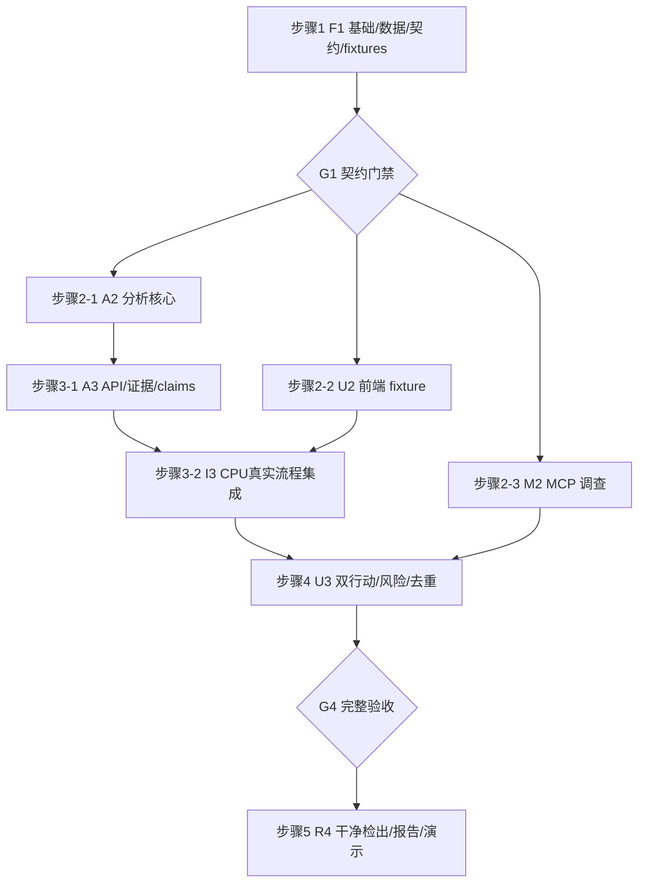

# Track 2 完整开发实施计划与并行调度

> **For agentic workers:** 实施时使用 superpowers:subagent-driven-development 或 superpowers:executing-plans。本文复选框仅在实际验收后勾选。本轮仅编写文档；执行前阅读规格和统一契约。用户已允许按依赖开展并行开发，不需要逐任务重复询问常规实现细节。

**Goal:** 交付可复现、可演示的英文 GPU 预算决策看板，支出、行动、误判成本与证据来自同一计算链。

**Architecture:** 保留官方生成和 API/MCP；单 FastAPI 承载新增 decision 路由；静态 React 前端同源访问；根级 Compose 作为评委入口。先冻结接口和数据载入，再并行分析、前端和 MCP 调查。

**Tech Stack:** Python/FastAPI/pandas/PyArrow、FastMCP、React/TypeScript/Vite、Nginx、Docker Compose；官方锁定版本保留，新增版本由基础任务实际解析锁定。

**Spec:** [开发规格](../specs/2026-09-17-track2-development-spec.md)、[统一契约](../specs/2026-09-17-track2-contracts.md)。

## Global Constraints

- 根目录 `/Users/yiyangluo/Desktop/hackathon-2026-official-t1`；英文产品/提交，中文内部计划。
- 官方数据已有成功校验结果，复用并迁移，不重复下载；当前状态不得按旧计划重置。
- 两个固定 ActionId：`cpu_migration`、`idle_session_reclaim`。接口仅 `/v1/decision`，snake_case JSON。
- 官方算法/五文件不改；新数据缓存只在根 out/；真实数据不提交，claims 必须可提交。
- 可用容量与兑现现金分开，P0 cash_savings_usd=null；区间为情景，confidence=null。
- 不把文档生成当成开发完成；不在本次写文档期间安装依赖、改应用或启动服务。
- 并行以契约门禁和文件所有权为前提；共享文件单写者，不靠最后提交覆盖冲突。

## 1. 阅读入口

| 文档 | 读者 | 负责问题 |
|---|---|---|
| 开发规格 | 所有人 | 做什么、架构和产品边界 |
| 统一契约 | 所有人，必读 | 字段、函数、路由、公式、错误码的唯一标准 |
| [01-foundation](track2/01-foundation.md) | 基础 agent/协调者 | 数据迁移、启动骨架、锁定、schema、fixtures |
| [02-analysis](track2/02-analysis.md) | 分析/API agent | 候选账本、收益、风险、去重、证据、claims |
| [03-dashboard](track2/03-dashboard.md) | 前端 agent | 三张卡、交互、状态、证据、真实数据接入 |
| [04-investigation](track2/04-investigation.md) | MCP agent | 真实工具调用、归因复核、有限审计和记录 |
| [05-integration-release](track2/05-integration-release.md) | 协调者/验收者 | 联调、发布、claims/报告/演示、干净检出 |

## 2. 为什么这样拆

顺序完成“全部分析→全部风险→页面”的方式会推迟对三十秒决策体验的检验。完全独立的多 agent 自行设计字段又会造成接口返工。本计划采用共同基础门禁之后的三路并行：真实分析、fixture 前端、MCP 调查。它们共享 contract，文件写入范围分开，第一次汇合就能形成可演示纵向流程。

## 3. 依赖图与阶段



M2 若尚未完成，I3 可显示 audit_status=not_run/running，不能伪造已完成；P0 最终门禁必须有真实审计记录。A2 先实现 CPU 及风险/账本结构，再加入 Idle；A3 可在 CPU 路径稳定后开始，但不得在双行动未就绪时假造第二行动收益。

| ID | 建议 owner | 依赖 | 可与谁并行 | 交付门禁 |
|---|---|---|---|---|
| F1 | 基础 agent | 规格/契约已读 | 不与其他应用写任务并行 | G1 |
| A2 | 分析 agent | G1 | U2、M2 | G2-A |
| U2 | 前端 agent | G1 | A2、M2 | G2-U |
| M2 | MCP agent | G1 | A2、U2、后续A3 | G2-M |
| A3 | 分析 agent | A2 | U2、M2 | G3-A |
| I3 | 协调者 | A3、U2 | M2（独立文件） | G3 CPU完整路径 |
| U3 | 前端 agent+协调者，文件分离 | I3、M2 | 无共享文件并写 | G4 |
| R4 | 协调者 | G4 | 报告文字可提前草拟 | 发布验收 |

当前最多三个工作 agent 加一个协调者。协调者负责接口审阅、集成和根文件；不再额外派出会写同一文件的第四个工作 agent。

## 4. 文件所有权（执行时作为写锁）

| 路径 | F1后 owner | 其他人如何使用 |
|---|---|---|
| 根 compose/Make/.gitignore/.env.example，data/README/checksums | 协调者 | 提交变更需求，不直接改 |
| 官方 api/data_loader.py 的路径适配 | 协调者 | 不修改计算口径 |
| 官方 api/main.py、models.py、生成/校验脚本 | 保持原样 | 复用；问题先上报 |
| decision/contracts.py、config.py、data.py、errors.py | 协调者（F1完成） | 共享依赖；数据载入已实现 |
| contracts/ schema、fixtures、official-checksums.txt | 协调者 | 只读消费；generated 经 make contracts 更新 |
| decision/baseline.py、candidates.py、portfolio.py、risk.py、service.py、claims.py、routes.py | 分析 agent | 其他人调用冻结接口 |
| decision/investigation.py、mcp_client.py、audit_storage.py | MCP agent | 通过 run/load_investigation 访问 |
| decision/app.py、bootstrap.py、cli.py，根报告/README/claims | 协调者 | A3提供 router；M2提供函数；只在汇合时接线 |
| dashboard/src/（不含 generated）、样式、UI测试 | 前端 agent | 不另造类型或财务计算 |
| dashboard/package*.json、构建/代理配置、Dockerfiles、Python lock | F1后协调者 | U2可以提出依赖需求，由协调者单次落锁 |
| tests/factories.py、tests/test_contracts.py | 协调者 | golden_snapshot/default_request 共享 |
| tests/test_{baseline,candidates,portfolio,risk,service,evidence,routes,claims,decision_smoke}.py、analysis_fixtures.py | 分析 agent | 只测试自身与共享契约 |
| tests/test_{mcp_client,investigation,audit_storage}.py | MCP agent | 不改共享 fixtures |
| decision/validation.py、tests/test_{release,validation}.py、scripts/*基础工具、pytest.ini、浏览器真实验收记录 | 协调者 | 接受各模块测试结果并复核 |

同一 checkout 下可按上表并行，但测试写 `out/tests/<task_id>/`，不能多个 agent 同时写根 claims/out 的相同文件。若使用 git worktree，基于 G1 同一提交创建 `codex/track2-analysis`、`codex/track2-dashboard`、`codex/track2-investigation`；数据不在 git，读取同一已验证数据绝对路径或只读复制。每个工作 agent 不启动占用相同宿主端口的 Compose；由协调者维护集成实例。不得自行 push/发布/修改默认分支。

## 5. 各门禁的具体证据

### G1：允许三个 agent 开工

- [ ] root data 五文件与官方摘要一致，已有数据未丢失；目录忽略正确。
- [ ] `load_snapshot` 可载入五表，返回稳定 dataset_id；`resolve_paths` 对本地/容器一致。
- [ ] 官方 `/health`、starter 示例链路可用；逐卡数据通过直接读取验证。
- [ ] Pydantic 与 JSON Schema/TS 导出完成，12份 fixtures 全部校验通过。
- [ ] `make check-contracts` 不依赖真实数据；契约生成时不启动 API store/MCP。
- [ ] `tests/factories.py` 的三任务 golden_snapshot 与文档手算一致。
- [ ] 根服务骨架可启动，未实现业务清楚显示 not_ready；没有成功返回伪造的真实收益。
- [ ] 发给三个 agent 同一 contract 版本/提交、可编辑文件清单、完成命令和 G1 证据。

### G2-A / G2-U / G2-M：分路完成

- [ ] G2-A：金额守恒、两候选、零峰值验证、异常时长、重排队排除、整作业归属、风险未知、价格变化的测试通过。
- [ ] G2-U：fixture 模式 UI 完整；默认 CPU、检查/选择分离、快速请求竞态、unknown、分页错误、键盘访问通过。
- [ ] G2-M：真实 MCP 子进程记录至少 health/rules/recommendations/findings/causal 的实际调用；有界审计状态与覆盖范围诚实；纯分析不受失败影响。

### G3-A / G3：第一个可演示版本

- [ ] G3-A：新增路由匹配 contract，错误码、分页、dataset_id一致性、claims mapping 经 API 测试。
- [ ] G3：真实数据下页面CPU金额→evidence→finding/job→GPU记录可点击；表格贡献值分页全量相加匹配同一 Evaluation。
- [ ] 改 GPU 价格后所有卡一起更新，候选/小时不变；导出的 claims 来自同一 request/evaluation_id。
- [ ] audit 尚未 ready 时真实显示状态，无 mock fallback。

### G4 / R4：完整交付

- [ ] 双行动组合重算后等于 marginal 之和，无 overlap重复；UI解释固定优先级。
- [ ] 风险参数缺失为 unknown；提供情景后返回有限有序区间；现金依然未知。
- [ ] 审计展示归因/截断/合成标记，空 causal 不显示错误。
- [ ] 官方数据和 claims 校验、项目语义校验、真实浏览器路径及干净检出启动通过。
- [ ] 英文说明、报告、AI披露、四分钟演示脚本齐备；团队名由用户实际信息提供。

## 6. 分派消息模板

```text
任务：步骤2-1 / A2（同理替换为U2或M2）
目标：完成你的模块计划中的A2门禁，不承担其他模块。
工作根：/Users/yiyangluo/Desktop/hackathon-2026-official-t1
必读：开发规格、统一契约v1.0.0、02-analysis.md。
G1基线：协调者提供实际提交ID与通过检查输出。
共享接口：按contracts.md原名，禁止自行修改schema/路由/ActionId。
写范围：按总计划文件所有权；共享变更先向协调者发具体diff建议。
验证：运行分模块计划指定命令，报告真实退出码与失败，不报告预期为实际。
交付：文件清单、关键算法/假设、命令结果、待集成项、数据与范围局限。
```

## 7. 变更、提交与失败处理

- 日常内部实现可自行推进；字段、计算口径、依赖锁、根挂载是共享变更，协调者统一处理并通知所有消费者。
- contract 字段变更后同一批更新 Pydantic、schema、TS、fixtures和文档，再重新打开 G1。不能只在前端兼容旧字段掩盖不一致。
- 小块改动完成后用显式文件列表提交；禁止 `git add .` 把 raw ZIP/别人的工作带入。各 agent 不互相 reset/rebase。
- 失败先定位：原始哈希不符→F1；公式不符→A2；请求/类型不符→A3；绘制/状态不符→U2；MCP超时/记录不符→M2；容器/根路径不符→协调者。
- 数据重新生成或 schema/analysis_version 变更，失效旧 Evaluation 缓存与审计缓存；旧参数记录可保留以帮助复现。
- 不以 UI 截图代替公式验证，不以 JSON schema 通过代替区间/去重验证，不以 HTTP200首页代替 API就绪。

## 8. 控制范围与时间

已完成的数据下载不再占用初步计划的20%时间。实施时优先投入 F1共享约束、CPU纵向流程、第二行动与真实MCP、最后干净交付。给最终验收至少预留剩余开发时间的20%；不是工期保证。

若时间紧：简化视觉装饰、隐藏 sample-capacity目标辅助指标、放弃自由聊天与P1；保留两行动的证据、风险未知、组合去重和一命令启动。计划的阶段可收缩实现复杂度，不能通过伪造收益或伪造工具记录完成。

## 9. 本文档交付后建议的第一次执行指令

“按照 `2026-09-17-track2-development-plan.md` 开始 F1，完成数据根、Compose、契约和 fixtures 门禁；通过后并行派发 A2、U2、M2。各 agent 遵守文件所有权，协调者负责共享文件和最终集成。”

这段是后续实施入口，本次写文档不等于已经执行上述任务。
