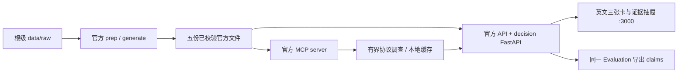

# Track 2 开发规格：GPU 预算决策看板

版本：1.0.0。日期：2026-09-17。状态：可供执行评审的开发规格；本次交付为文档，不代表应用已经实现。

## 1. 目标与完成定义

在英文单页看板中，让 CFO 在 30 秒内理解样本 GPU 支出去向、优先试点的行动及误判代价；让 SRE 从金额追到规则、finding、作业、物理 GPU 行和公式。保留官方 API/MCP 的原始语义，新增确定性 decision 层。页面、claims、报告使用同一计算结果。

第一里程碑必须同时具备：根目录 `docker compose up` → `http://localhost:3000` → 真实支出 → CPU 迁移候选 → 收益/风险情景 → 原始证据 → 同口径 claims。第二里程碑加入交互会话回收、组合去重和真实 MCP 调查。

本项目没有接入实际调度控制；按钮仅重新计算、浏览证据或导出。页面不得实际终止作业、停用节点或修改集群。

## 2. 文档体系与权威顺序

1. 用户当前指令与赛事正式约束。
2. 本规格：产品范围、架构、路径和验收目标。
3. [统一契约](2026-09-17-track2-contracts.md)：唯一的字段、枚举、函数签名、路由、公式与错误码规范。
4. [执行总计划](../plans/2026-09-17-track2-development-plan.md)：依赖、文件所有权、并行门禁。
5. 分模块计划：实施步骤、测试样例和交付清单。不得自行重新命名契约字段。

初步计划 `../plans/2026-09-17-track2-initial-plan.md` 保留为历史设计背景；其“未解压数据”“本计划不启动并行 agent”是写作当时的状态，不用于覆盖本次规划。

参考资料：仓库根 `PARTICIPANT_AGREEMENT.md`、`ATTRIBUTION.md`；`track-2/README.md`；`track-2/docs/{data,traps,rules,api,submission}.md`；`track-2/starter/claims.schema.json`。文档和 schema 冲突时同时满足二者可兼容的约束：提交 `team` 以及 schema 要求的 `recoverable_gpu_hours`。协议的评分权重高于校验脚本警告中的非权威评分描述。

## 3. 已知起点

- 工作根：`/Users/yiyangluo/Desktop/hackathon-2026-official-t1`。不要误用相邻同名目录。
- `track-2/data/raw/` 四个原始文件已下载；`prepped/` 两文件、`synthetic/` 三文件已生成，之前官方值级校验为 5/5 `ok`。
- Docker Desktop、Compose、uv 已可用；命令行 PATH 不一定包含 Docker，已知客户端位于 `/Applications/Docker.app/Contents/Resources/bin/docker`。
- 源码尚未新增 decision/dashboard；计划目录及 raw ZIP 曾为未跟踪文件。执行前重新检查 git 状态，保留其他任务的改动。
- 行数和既往成功记录用于定位问题，实际执行门禁仍以当次检查结果为准。

## 4. 范围

### P0：必须完成

- 全样本终态支出拆分，包含 CANCELLED、未知终态；官方 waterfall 的独立复算及代理指标说明。
- 两项行动：`cpu_migration`、`idle_session_reclaim`。每项包含责任角色、样本候选、保守情景区间、局限、试点、回滚。
- 一个选中行动组合的去重收益；固定归属优先级，不能累加重叠小时。
- 与当前查看行动相关联的误判风险；缺失信息明确为未知。
- 三张卡及证据抽屉；一条金额到 job/GPU 明细的完整路径。
- 实际 MCP 协议调用、可浏览的调查记录；明确无根因链与调用失败的区别。
- 根目录启动、claims 生成/验证、英文 REPORT 和 README、四分钟演示脚本。

### P1：P0 通过后另开任务

自由聊天、自动停用建议执行、完整调度模拟、季度需求预测、经统计校准的概率、任意时间范围筛选、任意复杂行动优化、完整资源拓扑画布、身份登录、多租户、数据库持久化。不把这些隐性加到 P0。

## 5. 架构决策

采用一个 FastAPI 进程加一个静态前端容器。`decision.app` 复用 `api.main.app` 并挂载 `/v1/decision` 路由，官方 `/v1/*` 和 `/health` 保持行为。decision 层自行加载逐卡明细；官方 Store 没有加载 `gpus.parquet`，不能假装它已有逐卡接口。

分析数据只读，启动后内存缓存；交互请求为确定性纯计算。不需要数据库、用户会话或 LLM API key。MCP 审计由受限的独立命令/启动准备步骤通过真正的 MCP Client 执行；其失败不阻塞基本看板，但最终交付门禁要求真实审计成功。

React + TypeScript + Vite，Nginx 容器服务 `:3000` 并代理 `/v1/` 到 `api:8000`；浏览器只使用同源相对 URL。开发模式由 Vite 提供同样代理。前端只做展示格式化，不重算财务公式。



不选择另建第二个业务 API 服务：当前数据量和团队规模不足以抵消它增加的地址、部署与数据同步成本。不选择全面重写官方 API：会增加官方口径漂移风险。不选择先做自由聊天：难以先保证每个数的可重算性。

## 6. 统一路径与运行配置

```text
<repo>/
  docker-compose.yml                 唯一有效 Compose 入口
  Makefile                           准备、运行、测试、导出、验证
  .gitignore
  .env.example                       只有非敏感默认值
  data/
    README.md                        可跟踪：根级数据准备说明
    checksums.txt                    可跟踪：官方原文件副本
    raw/ prepped/ synthetic/         不跟踪，评委使用同一根级 data/
  out/                               不跟踪：计算缓存、MCP 记录、测试截图
  claims.json                        可跟踪：最终提交结论
  REPORT.md                          英文
  README.md                          英文运行说明及 AI 使用披露
  track-2/
    api/                             保留，允许数据路径适配
    mcp_layer/                       保留目录名，避免遮蔽 mcp SDK
    scripts/                        保留官方脚本
    contracts/                      项目契约 schema 与手写虚构 fixtures
    decision/                       新增业务计算、API、审计与 CLI
    dashboard/                      React + TS
    tests/                          Python 单元/契约/集成测试
    requirements.decision.in         新增依赖声明
    requirements.decision.lock.txt   兼容官方约束的扩展锁定
    requirements.dev.in
    requirements.dev.lock.txt
    docker-compose.yml.example      旧入口参考，不再直接执行
```

环境变量固定：`MGAI_DATA_DIR` 为官方 loader 和 MCP 的数据根；`TRACK2_DATA_DIR` 为 decision 数据根（必须与前者解析到同一路径）；`TRACK2_OUTPUT_DIR` 为派生缓存根；`TRACK2_TEAM` 为真实团队名（开发可不设置，最终导出必须提供）；`TRACK2_AUDIT_MODE=auto|off` 默认 auto；`VITE_API_BASE_URL` 默认空字符串；`VITE_USE_FIXTURES=false` 默认 false。

容器内统一 `/app/data`、`/app/out`。代码目录 `/app/api`、`/app/decision`、`/app/mcp_layer`。根级数据迁移采用先复制/核验再切换挂载，禁止直接覆盖已有不同数据。官方 `requirements.lock.txt`、校验清单、生成器和数据处理算法保持不变；新依赖独立锁定并检查与官方版本相容。

`/data/*` 默认忽略，显式允许 README/checksums；忽略 raw ZIP、运行日志、录制响应、截图、notebook 输出、node_modules、dist、.env。显式允许根 `/claims.json`。手写虚构测试数据可跟踪；真实行级派生数据和 MCP 原始响应只存 `out/`。报告和 claims 仅输出要求的结论与方法，避免嵌入整段原始数据。

## 7. 产品与计算约束

- UI、README、REPORT、claims 的叙述使用英文；内部开发文档中文。
- 所有金额为 USD，价格必须显示为参考单价。`cash_savings_usd` 在 P0 固定未知，因为没有账单/合同/采购变更证据。
- 全样本窗口固定，不引入部分日期筛选。原始时间是 offset；映射日历日期必须标注来自官方 price book 的人为映射。
- 83% 是利用率加权的完成计算代理口径，不是失败作业占比，也不是可削减预算。不得把 row-weighted mean 当作成本权重。
- 官方 measured baseline 与清洗后 intervention ceiling 分开显示、分开命名；异常时间不得污染干预收益。
- CANCELLED 不整体视为浪费；对符合低活动/长期条件的特定候选也仅给出回收情景。
- synthetic 文件目录内多数记录源自真实遥测；只按记录标记识别合成事件。
- 固定置信度不能作为经过校准的错误概率。P0 区间统一 `interval_kind=scenario`、`confidence=null`，缺失信息不填零。
- 所有 Slurm/用户/数组 ID 经 API 输出为十进制字符串，物理 GPU index 仍为 0/1 整数。
- 当前选择组合与当前查看行动是不同状态；取消选中不应关闭其风险/证据详情。

## 8. 验证层级

1. 官方数据：五文件值级摘要匹配；不运行 checksum `--write`。
2. 纯计算：手算 fixtures 验证守恒、去重、异常、比例边界、零价格、未知风险。
3. 契约：Pydantic → JSON Schema → TypeScript 自动生成；前后端消费同一手写 fixture。
4. API：真实文件载入、规范错误码、分页全量可追溯、响应不含 NaN/Infinity。
5. UI：原子更新、避免旧请求覆盖、键盘访问、窄屏、错误/空/未知状态。
6. MCP：协议记录与可重算证据相符；空 causal 正常；未审计不能显示 verified。
7. 发布：干净检出、生成官方数据、plain `docker compose up`、真实浏览器完整路径、claims 官方及语义校验。

验收通过后才把任务复选框勾上；文档中的预期行为不是运行证据。不得为了消除校验器警告伪造 confidence 或无调查依据的 optional claims。
